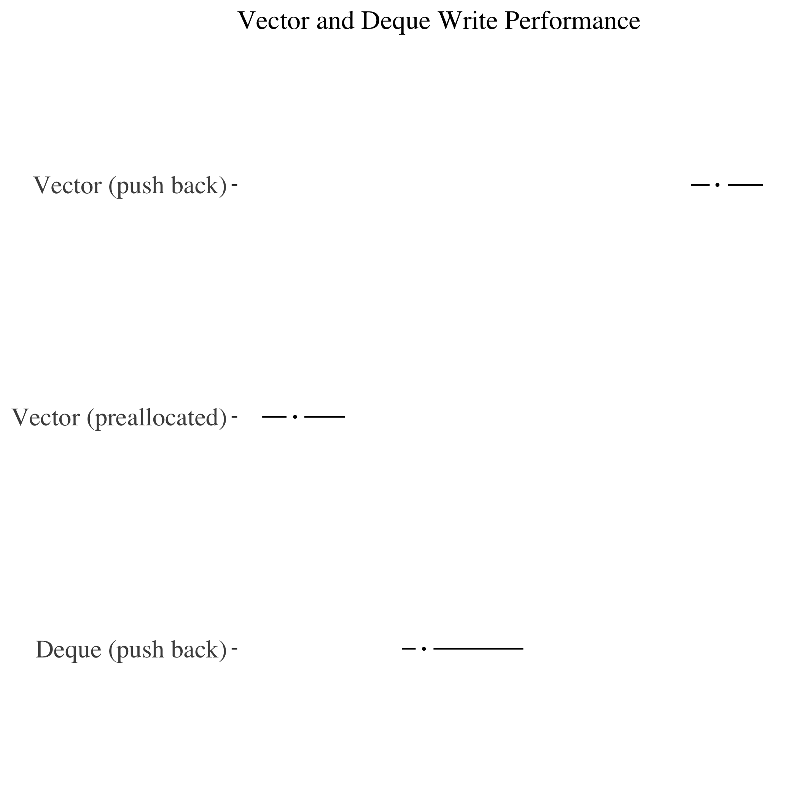

# Who?

## Me!

- Itinerant munger
- Incoming UW PhD
- They/Them


## Background

- Many, many packages
- Long-time R/C++ dev
- sometimes competent

# What is this?

## Speedups for your speedups

- Ways of making your C++ _even faster and more reliable_
- Assumes some Rcpp knowledge

## Rejected titles

- A Benchmark Too Far
- Honey I Shrunk the Runtime
- POINTER DEREFERENCING! The Musical

# Vectors and Deques

## Vectors

- C++ has vectors, just like R (and Rcpp!)
- Almost every time people are dealing with collections of single values...
- ...they use vectors


## And then bad stuff happens

- Vectors are stored as contiguous memory
- Expanding them is expensive
- Appending...expands them.

```{Rcpp, eval=FALSE}

int input_size = 1000000;

std::vector < std::string > uh_oh;

for(unsigned int i = 0; i < input_size; i++){
	
	uh_oh.push_back("noooooo!");
	
}

```

## Solution 1: preallocation!

- If you know the ultimate length of a vector: preallocate.
- One allocation for 1m elements instead of 1m allocations.

```{Rcpp, eval=FALSE}

int input_size = 1000000;

std::vector < std::string > preallocated_vector(vector_size);

for(unsigned int i = 0; i < input_size; i++){
	
	preallocated_vector[i] = "Watch us fly!";
	
}

```

## Solution 2: Deques!
- If you don't know the ultimate length, use deques
- Non-contiguous memory - cheaper to append to
- Still slower than preallocation, mind

```{Rcpp, eval=FALSE}

int input_size = 1000000;

std::deque < std::string > a_deque;

for(unsigned int i = 0; i < input_size; i++){
	
	a_deque.push_back("This works pretty well");
	
}

```

## Final proof

- 1m inserts to:
-- Preallocated vector
-- Non-allocated vector
-- Non-allocated deque
- Result:

## TADA
</img>

